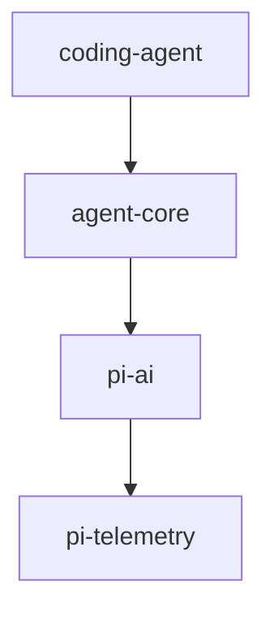

[上一篇](README.md) · [总目录](README.md) · [下一篇](01-简单框架-系统骨架.md)

# 00-文档规范与源码定位约定

> **版本**：0.0.3（commit `853a80d26`）
> **采样时间**：2026-08-31 13:17 CST
> **源码基准**：当前 `main` 分支源码

## 1. 源码定位规则

### 1.1 为什么不使用绝对行号

绝对行号随源码增删而漂移，不可靠。本库以 **文件路径 + 稳定符号名 + 函数内相对偏移** 为权威定位方式。

### 1.2 函数内部代码

格式：

```
packages/agent/src/agent-loop.ts
函数：runLoop
偏移：+12 ～ +30
```

- `+0` = 函数定义所在行
- `+1` = 函数定义下一行
- 以函数起始行为基准计算相对偏移

### 1.3 非函数代码

使用稳定符号：

```
packages/coding-agent/src/config.ts
Const：APP_NAME
```

```
packages/agent/src/types.ts
Interface：AgentLoopConfig
```

### 1.4 调用关系

标明调用方和被调用方：

```
packages/coding-agent/src/core/agent-session.ts
函数：prompt
调用偏移：+157
    ↓
packages/agent/src/agent.ts
方法：Agent.prompt
```

### 1.5 第三方依赖

注明版本：

```
依赖：typebox（npm，版本见 package-lock.json）
```

## 2. 图表规范

### 2.1 ASCII

用于端到端流程、请求/响应、数据流：

```
User Input → CLI → main() → AgentSession.prompt() → Agent.prompt()
    → runAgentLoop() → streamAssistantResponse() → LLM Provider
    → toolCalls → executeToolCalls() → Tool.execute()
    → ToolResult → next turn → agent_end → output
```

### 2.2 Mermaid

用于架构关系、模块依赖、类型关系、时序图：



**ASCII 负责阅读流程，Mermaid 负责表达结构和关系，不混用。**

## 3. 文档格式

每篇文档结构：

```markdown
[上一篇](prev.md) · [总目录](README.md) · [下一篇](next.md)

# <场景化标题>

> **场景**：说明本篇分析的场景
> **版本**：项目版本
> **源码基准**：当前源码

## 1. xxx
## 2. xxx

[上一篇](prev.md) · [总目录](README.md) · [下一篇](next.md)
```

## 4. 质量检查项

- [ ] 文件名正确、序号连续
- [ ] 导航链接正确
- [ ] 真实源码路径已标注
- [ ] 关键代码标注 Module/Struct/Class/Function
- [ ] 函数内部使用"函数名 + 相对偏移"
- [ ] 非函数代码使用稳定符号定位
- [ ] 调用关系标明调用方和被调用方
- [ ] 没有臆测、没有"同上/略/以此类推"
- [ ] 至少包含必要的 ASCII 或 Mermaid 图

---

[上一篇](README.md) · [总目录](README.md) · [下一篇](01-简单框架-系统骨架.md)
