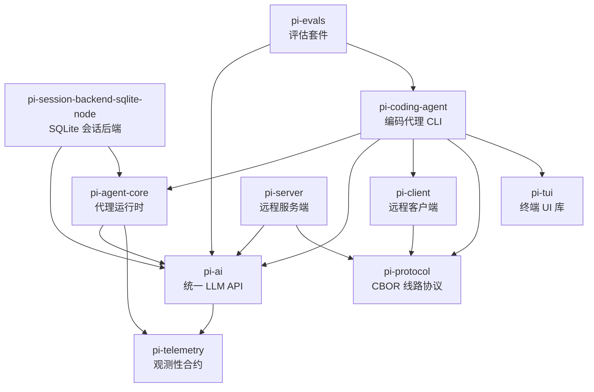

[上一篇](00-文档规范与源码定位约定.md) · [总目录](README.md) · [下一篇](02-简单例子-全路径走读.md)

# 01-简单框架-系统骨架

> **场景**：理解 Pi Agent Harness 整体架构
> **版本**：0.0.3（commit `853a80d26`）
> **源码基准**：当前 `main` 分支源码

## 1. 项目做什么

Pi Agent Harness 是一个**自扩展的 AI 编码代理**框架。核心功能：

- 接收用户自然语言提示词
- 调用 LLM（Anthropic/OpenAI/Google 等）生成回复
- LLM 可调用内置工具（read/bash/edit/write/grep/find/ls）操作文件系统
- 支持交互式 TUI、单次 print、JSON-RPC 三种运行模式
- 会话持久化（JSONL）、分支/fork、上下文压缩
- 扩展系统：自定义工具、命令、skills、prompt templates

## 2. 由什么组成

### 2.1 包依赖图



### 2.2 各包职责

| 包 | 职责 | 关键文件 |
|---|---|---|
| `pi-telemetry` | 可观测性合约、typed span schema、NOOP 实现 | `packages/telemetry/src/index.ts` |
| `pi-tui` | 终端 UI 组件库（差分渲染、markdown、图片、键绑定） | `packages/tui/src/tui.ts` |
| `pi-protocol` | CBOR 编解码、帧传输、命令/事件 schema | `packages/protocol/src/schemas.ts` |
| `pi-ai` | 多 Provider LLM 统一 API、模型发现、认证 | `packages/ai/src/types.ts` |
| `pi-agent-core` | Agent 类、agent loop、工具调用、状态管理 | `packages/agent/src/agent-loop.ts` |
| `pi-client` | 远程会话客户端（连接、租约、事件订阅） | `packages/client/src/client.ts` |
| `pi-server` | 远程会话服务端（会话管理、协议转换） | `packages/server/src/server.ts` |
| `pi-session-backend-sqlite-node` | Node SQLite 会话持久化 | `packages/session-backends/sqlite-node/src/sqlite/index.ts` |
| `pi-coding-agent` | CLI 应用（入口、AgentSession 编排、工具、模式、扩展） | `packages/coding-agent/src/cli.ts` |
| `pi-evals` | 评估测试套件 | `packages/evals/scripts/run-evals.mjs` |

### 2.3 核心组件

```
┌─────────────────────────────────────────────────────┐
│                    pi-coding-agent                   │
│                                                      │
│  ┌─────────┐  ┌──────────────┐  ┌─────────────────┐ │
│  │ CLI入口  │  │ AgentSession │  │   运行模式       │ │
│  │ cli.ts   │→ │ 编排层       │  │ Interactive/    │ │
│  │ main.ts  │  │              │  │ Print/Rpc       │ │
│  └─────────┘  └──────┬───────┘  └─────────────────┘ │
│                     │                                │
│  ┌──────────────────┼──────────────────────────┐   │
│  │        AgentSession 内部组件                 │   │
│  │  ┌────────────┐ ┌──────────┐ ┌────────────┐ │   │
│  │  │Tool Registry│ │Compaction│ │Extensions  │ │   │
│  │  └────────────┘ └──────────┘ └────────────┘ │   │
│  └──────────────────┼──────────────────────────┘   │
│                     │                                │
│  ┌──────────────────▼──────────────────────────┐   │
│  │           Agent (pi-agent-core)              │   │
│  │  ┌─────────────┐  ┌──────────────────────┐  │   │
│  │  │ agent-loop   │  │  PendingMessageQueue  │  │   │
│  │  │ runLoop()    │  │  (steer/followUp)    │  │   │
│  │  └──────┬──────┘  └──────────────────────┘  │   │
│  │         │                                    │   │
│  │  ┌──────▼──────┐                             │   │
│  │  │ streamFn    │ ──→ pi-ai (streamSimple)   │   │
│  │  └─────────────┘                             │   │
│  └──────────────────────────────────────────────┘   │
└─────────────────────────────────────────────────────┘
```

## 3. 请求怎么走

### 3.1 主数据流

```
用户输入文本
  │
  ▼
CLI (cli.ts → main.ts)
  │ 解析参数、创建 SessionManager、ModelRuntime、AgentSession
  ▼
AgentSession.prompt(text)
  │ 扩展命令检查 → skill/template 展开 → 验证 model/auth
  ▼
Agent.prompt(messages)
  │ 创建 context snapshot、设置 lifecycle
  ▼
runAgentLoop(prompts, context, config, emit, signal, streamFn)
  │
  ├── emit("agent_start"), emit("turn_start")
  │
  ├── runLoop()  ← 核心循环
  │   │
  │   ├── streamAssistantResponse()
  │   │   │ convertToLlm() → Message[]
  │   │   │ streamFn(model, context, options) → LLM Provider
  │   │   │ 流式接收 text_delta / toolcall_delta / done
  │   │   └ 返回 AssistantMessage
  │   │
  │   ├── 如果有 toolCalls
  │   │   └ executeToolCalls()
  │   │       │ prepareToolCall() → validate args → beforeToolCall hook
  │   │       │ executePreparedToolCall() → tool.execute()
  │   │       │ finalizeExecutedToolCall() → afterToolCall hook
  │   │       └ 返回 ToolResultMessage[]
  │   │
  │   ├── emit("turn_end")
  │   │
  │   └ 检查 steering/followUp → 继续循环或退出
  │
  ├── emit("agent_end")
  │
  ▼
运行模式层渲染输出
  │ Interactive: TUI 差分渲染
  │ Print: stdout 文本/JSON
  │ RPC: JSON-RPC over stdin/stdout
  ▼
用户看到结果
```

### 3.2 关键设计

- **AgentMessage 抽象**：agent 内部使用 `AgentMessage`（包含 custom 消息），仅在 LLM 调用边界通过 `convertToLlm()` 转为 `Message[]`
- **streamFn 注入**：`Agent` 不直接依赖 `pi-ai`，通过 `streamFn` 回调调用 LLM
- **事件驱动**：`runAgentLoop` 通过 `emit()` 发射事件，`Agent` 和 `AgentSession` 都订阅这些事件
- **工具钩子**：`beforeToolCall`/`afterToolCall` 在 agent-loop 层定义，在 `AgentSession` 层安装为扩展钩子
- **steering/followUp**：用户可在 agent 运行中插入消息（steer 中断当前轮，followUp 等待完成后继续）

## 4. 输入与输出

### 4.1 输入

| 来源 | 示例 |
|------|------|
| CLI 参数 | `pi -p "read config.json"` |
| 交互式输入 | TUI 编辑器中输入文本 |
| 管道 stdin | `echo "fix lint" \| pi` |
| RPC 请求 | JSON-RPC `prompt` 方法 |

### 4.2 输出

| 模式 | 输出 |
|------|------|
| Interactive | 全屏 TUI，markdown 渲染，工具面板 |
| Print (text) | stdout 输出最终 assistant 消息文本 |
| Print (json) | stdout 输出 JSON 事件流 |
| RPC | JSON-RPC 事件 over stdin/stdout |

## 5. 外部依赖

```
LLM Providers
  ├── Anthropic (anthropic-messages API)
  ├── OpenAI (openai-responses API)
  ├── Google (google-generative-ai API)
  ├── Bedrock (bedrock-converse-stream API)
  ├── Mistral
  └── Azure
        │
        ▼
  pi-ai 统一抽象
```

- 文件系统：通过 read/bash/edit/write 工具操作
- 会话存储：JSONL 文件（默认）或 SQLite（session-backend）
- 配置：`~/.pi/agent/settings.json`、`~/.pi/agent/auth.json`、`~/.pi/agent/models.json`

---

[上一篇](00-文档规范与源码定位约定.md) · [总目录](README.md) · [下一篇](02-简单例子-全路径走读.md)
