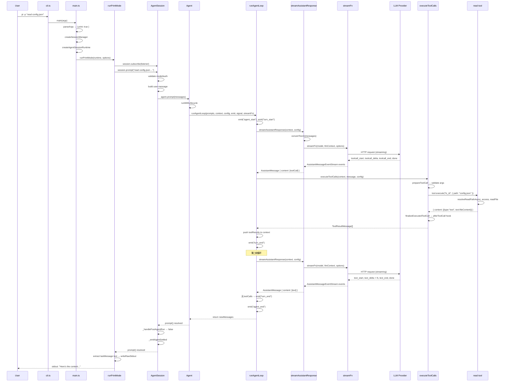

[上一篇](02-简单例子-全路径走读.md) · [总目录](README.md) · [下一篇](04-核心模块与类关系.md)

# 03-详细逐步说明-主链路拆解

> **场景**：`pi -p "read config.json"` 全路径逐跳拆解
> **版本**：0.0.3（commit `853a80d26`）
> **源码基准**：当前 `main` 分支源码

## 1. Step 1：CLI 启动

### 1.1 入口

```
packages/coding-agent/src/cli.ts
（模块顶层代码）
偏移：+12 ～ +21
```

执行内容：
1. `process.title = APP_NAME`（设为 "pi"）
2. `process.env.PI_CODING_AGENT = "true"`
3. `process.env.AI_AGENT = "pi"`
4. `configureHttpDispatcher()` — 配置 undici 全局 HTTP dispatcher
5. `main(process.argv.slice(2))` — 调用主函数

### 1.2 参数解析

```
packages/coding-agent/src/main.ts
函数：main
偏移：+561
```

- `args` = `["-p", "read config.json and show me the content"]`
- `parseArgs(args)` 返回 `Args` 对象，关键字段：
  - `print: true`
  - `messages: ["read config.json and show me the content"]`
- `resolveAppMode(parsed, stdinIsTTY, stdoutIsTTY)` → `"print"`

**参数传递**：`args: string[]` → `parseArgs` → `Args` → `resolveAppMode` → `AppMode`

### 1.3 创建 SessionManager

```
packages/coding-agent/src/main.ts
函数：createSessionManager
偏移：+352 ～ +443
```

- `parsed.noSession` = false, `parsed.session` = undefined, `parsed.continue` = false
- 走到 `SessionManager.create(cwd, sessionDir)` 分支
- 返回 `SessionManager` 实例，初始化 JSONL 会话文件

### 1.4 创建运行时

```
packages/coding-agent/src/main.ts
函数：main (createRuntime 闭包)
偏移：+712 ～ +838
```

- `createAgentSessionServices()` 创建：
  - `ModelRuntime` — 模型发现与 LLM 调用
  - `SettingsManager` — 全局/项目设置
  - `ResourceLoader` — 加载扩展、skills、context files
- `resolveModelScope()` → `scopedModels`（空或匹配 `--models`）
- `buildSessionOptions()` → `{ options: { model, thinkingLevel, scopedModels } }`
- `createAgentSessionFromServices()` → 调用 `createAgentSession()`

### 1.5 createAgentSession 内部

```
packages/coding-agent/src/core/sdk.ts
函数：createAgentSession
偏移：+173 ～ +410
```

关键步骤：
1. 解析 `model` — 优先 `options.model`，否则从 session 恢复，否则 `findInitialModel()`
2. 解析 `thinkingLevel` — 从 session/settings/默认值获取，然后 `clampThinkingLevel(model, thinkingLevel)`
3. 创建 `streamFn` 闭包（偏移 +314 ～ +342）：
   - 读取 `settingsManager.getProviderRetrySettings()`
   - 调用 `modelRuntime.streamSimple(model, context, { ...options, timeoutMs, maxRetries, transformHeaders })`
4. 创建 `convertToLlmWithBlockImages` 闭包 — 包装 `convertToLlm`，可选过滤图片
5. `new Agent({ initialState, convertToLlm, streamFn, onPayload, onResponse, transformContext, ... })`
6. 恢复 session 消息（如果 `hasExistingSession`）
7. `new AgentSession({ agent, sessionManager, settingsManager, cwd, ... })`

**状态变化**：`Agent._state` 初始化为 `{ systemPrompt: "", model, thinkingLevel, tools: [], messages: [], isStreaming: false }`

## 2. Step 2：进入 Print 模式

### 2.1 runPrintMode

```
packages/coding-agent/src/modes/print-mode.ts
函数：runPrintMode
偏移：+33 ～ +169
```

关键步骤：
1. `rebindSession()` — 绑定扩展、订阅事件
2. `session.subscribe(listener)` — listener 在 json 模式下写 JSON 事件到 stdout
3. `session.prompt(initialMessage, { images: initialImages })`
4. 循环 `session.prompt(message)` 发送后续消息
5. text 模式下：取 `state.messages[last]` 的 assistant 消息，提取 `content[].text`，`writeRawStdout()`

### 2.2 事件订阅

```
packages/coding-agent/src/core/agent-session.ts
方法：AgentSession.subscribe (通过 _eventListeners)
```

- `AgentSession` 内部通过 `this.agent.subscribe(this._handleAgentEvent)` 订阅 Agent 事件
- 外部调用者通过 `session.subscribe(listener)` 订阅 `AgentSessionEvent`
- 事件流：`runAgentLoop emit()` → `Agent.processEvents()` → `_handleAgentEvent()` → 外部 listener

## 3. Step 3：AgentSession.prompt(text)

### 3.1 prompt 方法

```
packages/coding-agent/src/core/agent-session.ts
方法：AgentSession.prompt
偏移：+1160 ～ +1318
```

逐段执行：

1. **扩展命令检查**（偏移 +1168 ～ +1175）：
   - `text.startsWith("/")` → false（普通文本）
   - 跳过

2. **Compaction 检查**（偏移 +1177 ～ +1181）：
   - `this._compactionAbortController` = undefined → 跳过

3. **Extension input 事件**（偏移 +1186 ～ +1201）：
   - `this._extensionRunner.hasHandlers("input")` → 可能 true（如果有扩展）
   - `emitInput(text, images, source, streamingBehavior)` → 通常返回 `{ action: "transform", text: sameText }` 或 `{ action: "pass" }`

4. **Skill/Template 展开**（偏移 +1204 ～ +1208）：
   - `_expandSkillCommand(expandedText)` — 检查 `/skill:name` 前缀
   - `expandPromptTemplate(expandedText, templates)` — 检查 `/template` 前缀
   - 普通文本无变化

5. **Streaming 检查**（偏移 +1211 ～ +1224）：
   - `this.isStreaming` = false（第一次调用）
   - 跳过 steer/followUp 逻辑

6. **Flush 待处理消息**（偏移 +1227 ～ +1228）：
   - `_flushPendingBashMessages()` — 无
   - `_flushPendingCustomMessages()` — 无

7. **验证 model 和 auth**（偏移 +1231 ～ +1248）：
   - `this.model` 存在
   - `this._modelRuntime.hasConfiguredAuth(provider)` → true
   - 通过

8. **Compaction 检查**（偏移 +1252 ～ +1255）：
   - `this._findLastAssistantMessage()` → undefined（新会话）
   - 跳过

9. **构建 messages**（偏移 +1258 ～ +1275）：
   ```typescript
   messages = [{
     role: "user",
     content: [{ type: "text", text: "read config.json ..." }],
     timestamp: Date.now()
   }]
   ```

10. **before_agent_start 扩展事件**（偏移 +1278 ～ +1306）：
    - `emitBeforeAgentStart(text, images, baseSystemPrompt, options)`
    - 可能返回自定义 systemPrompt 或额外 messages
    - `this.agent.state.systemPrompt = result.systemPrompt ?? this._baseSystemPrompt`

11. **调用 _runAgentPrompt**（偏移 +1317）：
    - `await this._runAgentPrompt(messages)`

### 3.2 _runAgentPrompt

```
packages/coding-agent/src/core/agent-session.ts
方法：AgentSession._runAgentPrompt
偏移：+1106 ～ +1119
```

```typescript
this._isAgentRunActive = true;
try {
  await this.agent.prompt(messages);           // ← 启动 Agent
  while (await this._handlePostAgentRun()) {    // ← 检查是否需要 continue
    await this.agent.continue();
  }
} finally {
  this._systemPromptOverride = undefined;
  this._flushPendingBashMessages();
  this._flushPendingCustomMessages();
  await this._emitAgentSettled();               // ← 发射 agent_settled
}
```

## 4. Step 4：Agent.prompt() → runAgentLoop()

### 4.1 Agent.prompt

```
packages/agent/src/agent.ts
方法：Agent.prompt
偏移：+350 ～ +358
```

- `normalizePromptInput(input, images)` — 将 string 转为 `AgentMessage[]`
- 调用 `this.runPromptMessages(messages)`

### 4.2 runPromptMessages

```
packages/agent/src/agent.ts
方法：Agent.runPromptMessages
偏移：+409 ～ +423
```

```typescript
await this.runWithLifecycle(async (signal) => {
  await runAgentLoop(
    messages,                              // prompts
    this.createContextSnapshot(),           // context
    this.createLoopConfig(),               // config
    (event) => this.processEvents(event),  // emit callback
    signal,
    this.streamFunction,                   // streamFn
  );
});
```

### 4.3 createContextSnapshot

```
packages/agent/src/agent.ts
方法：Agent.createContextSnapshot
偏移：+437 ～ +443
```

返回：
```typescript
{
  systemPrompt: this._state.systemPrompt,    // 系统提示词
  messages: this._state.messages.slice(),    // 对话副本
  tools: this._state.tools.slice(),          // 工具列表
}
```

### 4.4 createLoopConfig

```
packages/agent/src/agent.ts
方法：Agent.createLoopConfig
偏移：+445 ～ +484
```

构建 `AgentLoopConfig`，关键字段：
- `model: this._state.model`
- `reasoning: this._state.thinkingLevel === "off" ? undefined : this._state.thinkingLevel`
- `convertToLlm: this.convertToLlm` — 转换 AgentMessage[] → Message[]
- `transformContext: this.transformContext` — 扩展可修改 context
- `beforeToolCall: this.beforeToolCall` — 工具前置钩子
- `afterToolCall: this.afterToolCall` — 工具后置钩子
- `getSteeringMessages: async () => this.steeringQueue.drain()` — 取 steering 消息
- `getFollowUpMessages: async () => this.followUpQueue.drain()` — 取 followUp 消息

### 4.5 runWithLifecycle

```
packages/agent/src/agent.ts
方法：Agent.runWithLifecycle
偏移：+486 ～ +509
```

- 创建 `AbortController`
- 设置 `this.activeRun = { promise, resolve, abortController }`
- 设置 `this._state.isStreaming = true`
- 执行 `executor(signal)` — 即 `runAgentLoop(...)`
- finally: `this.finishRun()`

## 5. Step 5：runAgentLoop

### 5.1 入口

```
packages/agent/src/agent-loop.ts
函数：runAgentLoop
偏移：+96 ～ +119
```

```typescript
const newMessages: AgentMessage[] = [...prompts];
const currentContext: AgentContext = {
  ...context,
  messages: [...context.messages, ...prompts],  // 合并已有消息和新 prompt
};

await emit({ type: "agent_start" });
await emit({ type: "turn_start" });
for (const prompt of prompts) {
  await emit({ type: "message_start", message: prompt });
  await emit({ type: "message_end", message: prompt });
}

await runLoop(currentContext, newMessages, config, signal, emit, streamFn);
return newMessages;
```

**数据流**：`prompts` + `context.messages` → 合并 → `currentContext`

**事件发射**：`agent_start` → `turn_start` → 每条 prompt 的 `message_start`/`message_end`

### 5.2 runLoop — 核心循环

```
packages/agent/src/agent-loop.ts
函数：runLoop
偏移：+156 ～ +273
```

结构：

```
runLoop
 │
 ├── 初始化 pendingMessages = await getSteeringMessages?.()
 │
 ├── 外循环 while(true):
 │   │
 │   ├── 内循环 while(hasMoreToolCalls || pendingMessages.length > 0):
 │   │   │
 │   │   ├── [if lastCompletedTurn] prepareNextTurn()
 │   │   ├── [if pendingMessages] 发射 message_start/end, push 到 context
 │   │   │
 │   │   ├── streamAssistantResponse() → AssistantMessage
 │   │   │   返回值: { content: [...], stopReason: "tool_use" | "end_turn" | ... }
 │   │   │
 │   │   ├── [if stopReason == "error" | "aborted"] → emit turn_end, agent_end, return
 │   │   │
 │   │   ├── 提取 toolCalls = message.content.filter(type === "toolCall")
 │   │   │
 │   │   ├── [if toolCalls.length > 0]:
 │   │   │   executeToolCalls() → { messages: ToolResultMessage[], terminate: bool }
 │   │   │   push toolResults to context
 │   │   │   hasMoreToolCalls = !terminate
 │   │   │
 │   │   ├── emit("turn_end", message, toolResults)
 │   │   │
 │   │   ├── lastCompletedTurn = { message, toolResults, context, newMessages }
 │   │   │
 │   │   ├── [if shouldStopAfterTurn] → emit agent_end, return
 │   │   │
 │   │   └── pendingMessages = await getSteeringMessages?.()
 │   │
 │   └── [外循环] 检查 followUpMessages
 │       if (followUp.length > 0): pendingMessages = followUp, continue
 │       else: break
 │
 └── emit("agent_end", newMessages)
```

## 6. Step 6：第一轮 — LLM 返回 toolCall

### 6.1 streamAssistantResponse

```
packages/agent/src/agent-loop.ts
函数：streamAssistantResponse
偏移：+279 ～ +370
```

执行流程：

1. **transformContext**（偏移 +288 ～ +290）：
   - `config.transformContext` 存在（由 `AgentSession` 注入，用于 compaction）
   - `messages = await config.transformContext(messages, signal)` — 可能压缩旧消息

2. **convertToLlm**（偏移 +293）：
   - `const llmMessages = await config.convertToLlm(messages)`
   - 将 `AgentMessage[]` 转为 `Message[]`（过滤 custom 消息、转换格式）

3. **构建 LLM context**（偏移 +296 ～ +300）：
   ```typescript
   const llmContext: Context = {
     systemPrompt: context.systemPrompt,
     messages: llmMessages,
     tools: context.tools,
   };
   ```

4. **解析 API key**（偏移 +303 ～ +304）：
   - `config.getApiKey(model.provider)` — 动态解析（处理 OAuth token 过期）

5. **调用 streamFn**（偏移 +306 ～ +310）：
   ```typescript
   const response = await streamFunction(config.model, llmContext, {
     ...config,
     apiKey: resolvedApiKey,
     signal,
   });
   ```
   - `streamFunction` 是 `createAgentSession` 中创建的闭包
   - 最终调用 `modelRuntime.streamSimple(model, context, options)`
   - `streamSimple` 分发到具体 Provider SDK

6. **流式事件处理**（偏移 +315 ～ +359）：
   ```
   for await (const event of response):
     case "start":
       partialMessage = event.partial
       context.messages.push(partialMessage)    ← 加入 context（后续 delta 原地更新）
       emit("message_start", partialMessage)

     case "toolcall_start" | "toolcall_delta" | "toolcall_end":
       partialMessage = event.partial
       context.messages[last] = partialMessage  ← 原地替换
       emit("message_update", event, partialMessage)

     case "done" | "error":
       finalMessage = await response.result()
       context.messages[last] = finalMessage   ← 最终化
       emit("message_end", finalMessage)
       return finalMessage
   ```

**状态变化**：
- `context.messages` 增加了 assistant 消息
- `Agent._state.streamingMessage` 跟踪当前流式消息

### 6.2 executeToolCalls

```
packages/agent/src/agent-loop.ts
函数：executeToolCalls
偏移：+409 ～ +424
```

- 提取 `toolCalls = assistantMessage.content.filter(type === "toolCall")`
- 检查是否有 `sequential` 执行模式的工具
- `config.toolExecution === "sequential"` || `hasSequentialToolCall` → 调用 `executeToolCallsSequential`
- 否则 → `executeToolCallsParallel`

### 6.3 prepareToolCall

```
packages/agent/src/agent-loop.ts
函数：prepareToolCall
偏移：+598 ～ +666
```

1. 查找工具：`currentContext.tools?.find(t => t.name === toolCall.name)`
2. 如果找不到 → 返回 `{ kind: "immediate", result: errorResult, isError: true }`
3. `prepareToolCallArguments(tool, toolCall)` — 调用 `tool.prepareArguments`（如果存在）
4. `validateToolArguments(tool, preparedToolCall)` — TypeBox schema 校验
5. `config.beforeToolCall({ assistantMessage, toolCall, args, context }, signal)` — 扩展钩子
   - 如果返回 `{ block: true }` → 立即返回错误结果
6. 返回 `{ kind: "prepared", toolCall, tool, args }`

### 6.4 executePreparedToolCall

```
packages/agent/src/agent-loop.ts
函数：executePreparedToolCall
偏移：+668 ～ +709
```

```typescript
const result = await prepared.tool.execute(
  prepared.toolCall.id,        // "tc_01ABC"
  prepared.args as never,      // { path: "config.json" }
  signal,                       // AbortSignal
  (partialResult) => {         // onUpdate callback
    emit({ type: "tool_execution_update", partialResult, ... })
  },
);
return { result, isError: false };
```

**read 工具的 execute**（`packages/coding-agent/src/core/tools/read.ts`，偏移 +223 ～ +334）：
1. `resolveReadPathAsync(path, cwd)` → 绝对路径
2. `ops.access(absolutePath)` → 检查可读
3. `ops.detectImageMimeType(absolutePath)` → null（非图片）
4. `ops.readFile(absolutePath)` → Buffer
5. `buffer.toString("utf-8")` → 文本
6. `truncateHead(selectedContent)` → 截断到 `DEFAULT_MAX_LINES` 或 `DEFAULT_MAX_BYTES`
7. 返回 `{ content: [{ type: "text", text: outputText }], details: { truncation } }`

### 6.5 finalizeExecutedToolCall

```
packages/agent/src/agent-loop.ts
函数：finalizeExecutedToolCall
偏移：+711 ～ +756
```

- `config.afterToolCall({ assistantMessage, toolCall, args, result, isError, context }, signal)`
  - 在 `AgentSession._installAgentToolHooks()` 中安装
  - 调用 `this._extensionRunner.emitToolResult(...)` — 扩展可修改结果
  - `normalizeToolResultImages(content, { autoResizeImages })` — 标准化图片
- 返回 `{ toolCall: prepared.toolCall, result, isError }`

### 6.6 createToolResultMessage

```
packages/agent/src/agent-loop.ts
函数：createToolResultMessage
偏移：+775 ～ +789
```

```typescript
{
  role: "toolResult",
  toolCallId: finalized.toolCall.id,    // "tc_01ABC"
  toolName: finalized.toolCall.name,    // "read"
  content: finalized.result.content,    // [{ type: "text", text: fileContent }]
  details: finalized.result.details,    // { truncation: ... }
  usage: finalized.result.usage,
  isError: finalized.isError,           // false
  timestamp: Date.now(),
}
```

## 7. Step 7：第二轮 — LLM 返回最终文本

第二轮 `streamAssistantResponse` 调用时：

- `context.messages` 现在包含：`[user, assistant(toolCall), toolResult]`
- `convertToLlm` 将其转为 `Message[]`：`[user, assistant, toolResult]`
- LLM 看到工具结果（文件内容），生成最终文本回复
- `stopReason = "end_turn"`，无 toolCalls
- `hasMoreToolCalls = false`
- `pendingMessages = []`（无 steering）
- 退出内循环
- `followUpMessages = []`（无 followUp）
- 退出外循环
- `emit("agent_end", newMessages)`

## 8. Step 8：输出与清理

### 8.1 runPrintMode 输出

```
packages/coding-agent/src/modes/print-mode.ts
函数：runPrintMode
偏移：+139 ～ +156
```

text 模式：
```typescript
const state = session.state;
const lastMessage = state.messages[state.messages.length - 1];
if (lastMessage?.role === "assistant") {
  const assistantMsg = lastMessage as AssistantMessage;
  for (const content of assistantMsg.content) {
    if (content.type === "text") {
      writeRawStdout(`${content.text}\n`);
    }
  }
}
```

### 8.2 清理

```
packages/coding-agent/src/modes/print-mode.ts
函数：runPrintMode (finally 块)
偏移：+162 ～ +168
```

- 清理 signal handlers
- `await disposeRuntime()` — 取消订阅、dispose 运行时
- `await flushRawStdout()`

## 9. 错误传播

主成功路径无错误。以下是关键错误传播路径：

| 错误来源 | 传播方式 | 最终处理 |
|---------|---------|---------|
| LLM API 错误 | `streamFn` 返回的 stream 中 `event.type === "error"` | `streamAssistantResponse` 在 `done/error` 分支获取 `finalMessage`，`stopReason = "error"` |
| `stopReason === "error"` | `runLoop` 检查后 emit `turn_end`/`agent_end` | `Agent.handleRunFailure` 发射 failure message |
| 工具未找到 | `prepareToolCall` 返回 `ImmediateToolCallOutcome` with error | 直接作为 toolResult 返回，LLM 可看到错误 |
| 工具 execute 抛异常 | `executePreparedToolCall` catch → `{ result: errorResult, isError: true }` | 作为 toolResult 返回 |
| 参数校验失败 | `prepareToolCall` catch → `ImmediateToolCallOutcome` with error | 同上 |

## 10. 时序图



---

[上一篇](02-简单例子-全路径走读.md) · [总目录](README.md) · [下一篇](04-核心模块与类关系.md)
