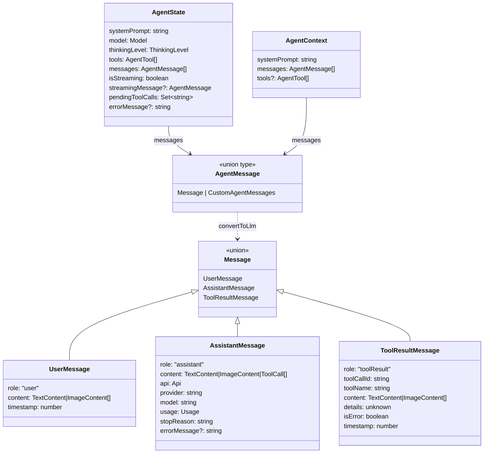
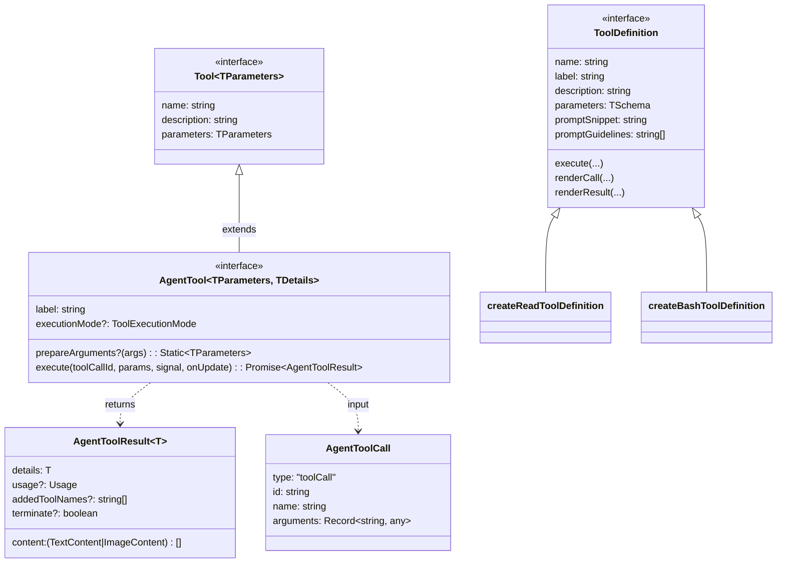
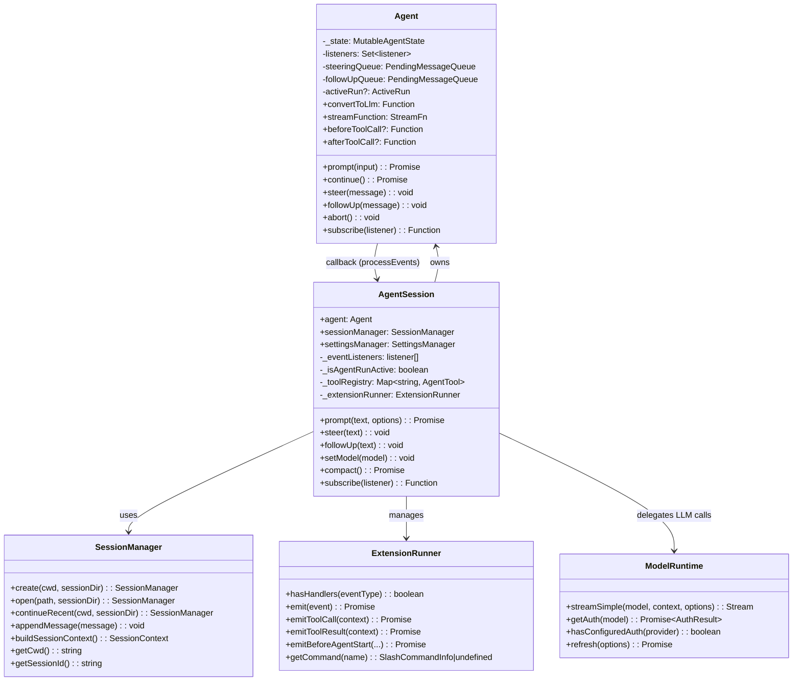
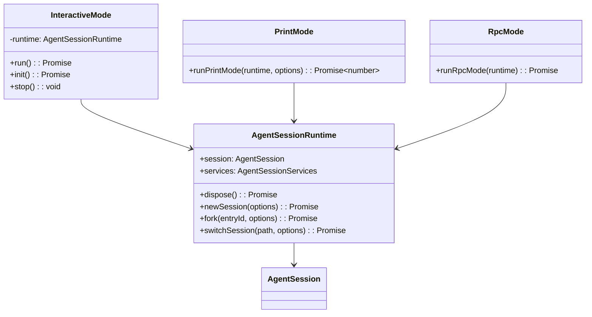

[上一篇](03-详细逐步说明-主链路拆解.md) · [总目录](README.md) · [下一篇](05-函数级源码解析-CLI入口与主流程.md)

# 04-核心模块与类关系

> **场景**：Pi 项目的模块级与类型级关系全景
> **版本**：0.0.3（commit `853a80d26`）
> **源码基准**：当前 `main` 分支源码

## 1. 模块依赖层次

```
Layer 0 (叶子，无内部依赖):
  pi-telemetry     pi-tui     pi-protocol

Layer 1 (依赖 Layer 0):
  pi-ai → pi-telemetry

Layer 2 (依赖 Layer 0-1):
  pi-agent-core → pi-ai, pi-telemetry
  pi-server → pi-ai, pi-protocol
  pi-client → pi-protocol

Layer 3 (依赖 Layer 0-2):
  pi-session-backend-sqlite-node → pi-ai, pi-agent-core
  pi-coding-agent → pi-agent-core, pi-ai, pi-client, pi-protocol, pi-tui

Layer 4 (应用层):
  pi-evals → pi-ai, pi-coding-agent
```

## 2. 核心类型关系

### 2.1 Agent 消息类型体系



**源码定位**：
- `AgentMessage` — `packages/agent/src/types.ts`，Type alias
- `AgentState` — `packages/agent/src/types.ts`，Interface
- `AgentContext` — `packages/agent/src/types.ts`，Interface
- `UserMessage`/`AssistantMessage`/`ToolResultMessage` — `packages/ai/src/types.ts`

### 2.2 工具类型体系



**源码定位**：
- `Tool` — `packages/ai/src/types.ts`（基础接口）
- `AgentTool` — `packages/agent/src/types.ts`，Interface
- `AgentToolResult` — `packages/agent/src/types.ts`，Interface
- `ToolDefinition` — `packages/coding-agent/src/core/extensions/types.ts`，Interface

### 2.3 Agent 核心类关系



### 2.4 运行模式关系



## 3. 关键 Interface/Type 定义

### 3.1 AgentLoopConfig

```
文件：packages/agent/src/types.ts
Interface：AgentLoopConfig
```

继承 `SimpleStreamOptions`，核心字段：

| 字段 | 类型 | 说明 |
|------|------|------|
| `model` | `Model<any>` | 当前使用的 LLM 模型 |
| `convertToLlm` | `(AgentMessage[]) => Message[]` | AgentMessage → LLM Message 转换 |
| `transformContext` | `(messages, signal) => Promise<AgentMessage[]>` | context 变换（compaction 等） |
| `getApiKey` | `(provider) => Promise<string \| undefined>` | 动态 API key 解析 |
| `beforeToolCall` | `(context, signal) => Promise<BeforeToolCallResult?>` | 工具前置钩子 |
| `afterToolCall` | `(context, signal) => Promise<AfterToolCallResult?>` | 工具后置钩子 |
| `shouldStopAfterTurn` | `(context) => boolean` | 轮次后停止判断 |
| `prepareNextTurn` | `(context) => AgentLoopTurnUpdate?` | 下一轮准备 |
| `getSteeringMessages` | `() => Promise<AgentMessage[]>` | 获取 steering 队列 |
| `getFollowUpMessages` | `() => Promise<AgentMessage[]>` | 获取 followUp 队列 |
| `toolExecution` | `"sequential" \| "parallel"` | 工具执行模式 |

### 3.2 ThinkingLevel

```
文件：packages/agent/src/types.ts
Type alias：ThinkingLevel
```

```typescript
type ThinkingLevel = "off" | "minimal" | "low" | "medium" | "high" | "xhigh" | "max";
```

### 3.3 QueueMode

```
文件：packages/agent/src/types.ts
Type alias：QueueMode
```

```typescript
type QueueMode = "all" | "one-at-a-time";
```

### 3.4 ToolExecutionMode

```
文件：packages/agent/src/types.ts
Type alias：ToolExecutionMode
```

```typescript
type ToolExecutionMode = "sequential" | "parallel";
```

### 3.5 StreamFn

```
文件：packages/agent/src/types.ts
Type alias：StreamFn
```

```typescript
type StreamFn = (
  model: Model<Api>,
  context: Context,
  options?: SimpleStreamOptions,
) => AssistantMessageEventStream | Promise<AssistantMessageEventStream>;
```

## 4. 配置常量

### 4.1 coding-agent 配置

```
文件：packages/coding-agent/src/config.ts
Const：APP_NAME = "pi"
Const：CONFIG_DIR_NAME = ".pi"
Const：VERSION = pkg.version || "0.0.0"
```

### 4.2 工具默认值

```
文件：packages/coding-agent/src/core/tools/truncate.ts
Const：DEFAULT_MAX_LINES
Const：DEFAULT_MAX_BYTES
```

### 4.3 默认思考级别

```
文件：packages/coding-agent/src/core/defaults.ts
Const：DEFAULT_THINKING_LEVEL
```

### 4.4 默认工具集

```
文件：packages/coding-agent/src/core/sdk.ts
（在 createAgentSession 内，偏移 +256）
defaultActiveToolNames: ToolName[] = ["read", "bash", "edit", "write"]
```

## 5. 模块对外接口

### 5.1 pi-agent-core 导出

```
文件：packages/agent/src/index.ts
Module：pi-agent-core
```

核心导出：
- `Agent` — 状态化代理类
- `runAgentLoop` / `runAgentLoopContinue` — 低级循环函数
- `AgentSession`（不在 agent-core，在 coding-agent）
- `AgentState`/`AgentContext`/`AgentMessage`/`AgentEvent` — 类型
- `AgentTool`/`AgentToolResult` — 工具接口
- `AgentLoopConfig` — 循环配置
- `setDefaultStreamFn`/`getDefaultStreamFn` — 默认 stream 函数

### 5.2 pi-ai 导出

```
文件：packages/ai/src/index.ts
Module：pi-ai
```

核心导出：
- `Message`/`AssistantMessage`/`UserMessage`/`ToolResultMessage` — 消息类型
- `Model`/`Models` — 模型类型
- `Context` — LLM 上下文
- `Tool` — 基础工具接口
- `Usage` — token 用量
- `EventStream` — 异步迭代器
- `validateToolArguments` — 参数校验

子路径导出：
- `pi-ai/compat` → `streamSimple`/`clampThinkingLevel`/`isContextOverflow` 等
- `pi-ai/providers/*` → 各 Provider 工厂

### 5.3 pi-coding-agent 导出

```
文件：packages/coding-agent/src/core/index.ts
Module：pi-coding-agent
```

核心导出：
- `createAgentSession` — 会话工厂
- `AgentSession` — 编排类
- `AgentSessionRuntime` — 运行时
- `ExtensionAPI`/`ToolDefinition` — 扩展接口
- 各工具工厂函数

## 6. 事件类型全景

```mermaid
graph TD
    subgraph Agent 层事件
        A1[agent_start]
        A2[turn_start]
        A3[message_start]
        A4[message_update]
        A5[message_end]
        A6[tool_execution_start]
        A7[tool_execution_update]
        A8[tool_execution_end]
        A9[turn_end]
        A10[agent_end]
    end

    subgraph AgentSession 扩展事件
        B1[agent_settled]
        B2[queue_update]
        B3[compaction_start]
        B4[compaction_end]
        B5[entry_appended]
        B6[session_info_changed]
        B7[thinking_level_changed]
        B8[auto_retry_start]
        B9[auto_retry_end]
        B10[bash_execution_update]
    end

    A10 --> B1
    A3 --> B5 : message_end → persist
    A8 --> B5 : tool_result → persist
```

**源码定位**：
- `AgentEvent` — `packages/agent/src/types.ts`，Type alias
- `AgentSessionEvent` — `packages/coding-agent/src/core/agent-session.ts`，Type alias

---

[上一篇](03-详细逐步说明-主链路拆解.md) · [总目录](README.md) · [下一篇](05-函数级源码解析-CLI入口与主流程.md)
