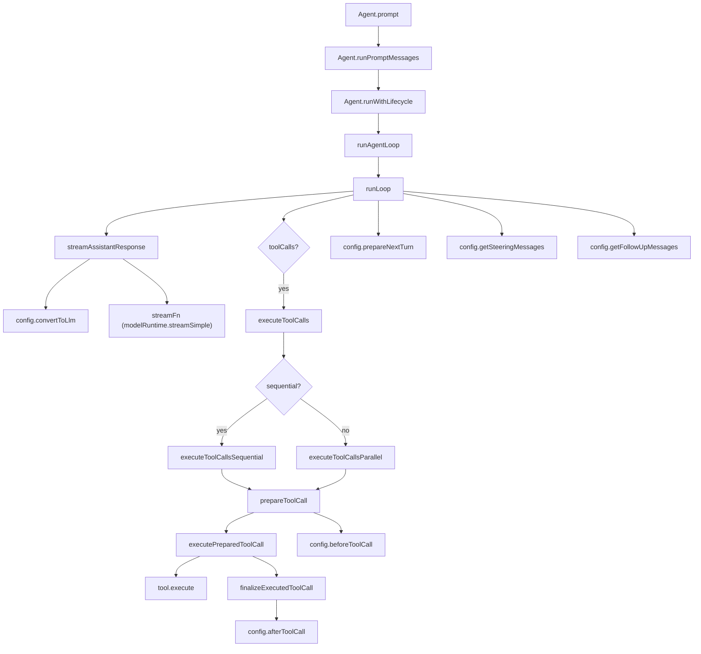

[上一篇](05-函数级源码解析-CLI入口与主流程.md) · [总目录](README.md) · [下一篇](07-函数级源码解析-AgentSession编排层.md)

# 06-函数级源码解析-Agent引擎与循环

> **场景**：Agent 类和 agent-loop 的函数级分析
> **版本**：0.0.3（commit `853a80d26`）
> **源码基准**：当前 `main` 分支源码

## 1. 类：Agent

**源码**：`packages/agent/src/agent.ts`
**所属**：模块顶层
**职责**：状态化代理包装器，管理对话状态、生命周期事件、工具钩子、消息队列

### 1.1 构造函数

**方法**：`Agent.constructor`
**偏移**：+216 ～ +238
**参数**：`options: AgentOptions`
**职责**：初始化所有内部状态

```
偏移 +219: this._state = createMutableAgentState(options.initialState)
偏移 +220: this.convertToLlm = options.convertToLlm ?? defaultConvertToLlm
偏移 +221: this.transformContext = options.transformContext
偏移 +222: this.streamFunction = options.streamFn ?? getDefaultStreamFn()
偏移 +223: this.getApiKey = options.getApiKey
偏移 +225: this.beforeToolCall = options.beforeToolCall
偏移 +226: this.afterToolCall = options.afterToolCall
偏移 +231: this.steeringQueue = new PendingMessageQueue(options.steeringMode ?? "one-at-a-time")
偏移 +232: this.followUpQueue = new PendingMessageQueue(options.followUpMode ?? "one-at-a-time")
偏移 +236: this.transport = options.transport ?? "auto"
偏移 +237: this.toolExecution = options.toolExecution ?? "parallel"
```

### 1.2 prompt

**方法**：`Agent.prompt`
**偏移**：+348 ～ +358
**参数**：`input: string | AgentMessage | AgentMessage[]`, `images?: ImageContent[]`
**职责**：启动新的提示词运行

```
偏移 +351: if (this.activeRun) throw Error("Agent is already processing...")
偏移 +356: messages = this.normalizePromptInput(input, images)
偏移 +357: await this.runPromptMessages(messages)
```

### 1.3 normalizePromptInput

**方法**：`Agent.normalizePromptInput`
**偏移**：+390 ～ +407
**职责**：将输入归一化为 `AgentMessage[]`

```
if (Array.isArray(input)) → return input
if (typeof input !== "string") → return [input]
// string → AgentMessage
content = [{ type: "text", text: input }]
if (images) → content.push(...images)
return [{ role: "user", content, timestamp: Date.now() }]
```

### 1.4 runPromptMessages

**方法**：`Agent.runPromptMessages`
**偏移**：+409 ～ +423
**职责**：通过 lifecycle 调用 `runAgentLoop`

```typescript
await this.runWithLifecycle(async (signal) => {
  await runAgentLoop(
    messages,
    this.createContextSnapshot(),      // context 快照
    this.createLoopConfig(),            // 循环配置
    (event) => this.processEvents(event),  // 事件回调
    signal,
    this.streamFunction,
  );
});
```

### 1.5 createContextSnapshot

**方法**：`Agent.createContextSnapshot`
**偏移**：+437 ～ +443
**职责**：创建当前状态的不可变快照

```typescript
return {
  systemPrompt: this._state.systemPrompt,
  messages: this._state.messages.slice(),  // 浅拷贝
  tools: this._state.tools.slice(),        // 浅拷贝
};
```

### 1.6 createLoopConfig

**方法**：`Agent.createLoopConfig`
**偏移**：+445 ～ +484
**职责**：构建 `AgentLoopConfig` 对象

关键逻辑：
```
偏移 +446: skipInitialSteeringPoll = options.skipInitialSteeringPoll === true
偏移 +448: config.model = this._state.model
偏移 +449: config.reasoning = this._state.thinkingLevel === "off" ? undefined : this._state.thinkingLevel
偏移 +454: config.convertToLlm = this.convertToLlm
偏移 +455: config.transformContext = this.transformContext
偏移 +456: config.getApiKey = this.getApiKey
偏移 +457: config.beforeToolCall = this.beforeToolCall
偏移 +458: config.afterToolCall = this.afterToolCall
偏移 +460: config.shouldStopAfterTurn = shouldStopAfterTurn ? (ctx) => shouldStopAfterTurn(ctx, this.signal) : undefined
偏移 +463: config.prepareNextTurn = (ctx) => this.prepareNextTurnWithContext?.(ctx, this.signal) ?? ...
偏移 +475: config.getSteeringMessages = async () => {
  if (skipInitialSteeringPoll) { skipInitialSteeringPoll = false; return []; }
  return this.steeringQueue.drain();
}
偏移 +482: config.getFollowUpMessages = async () => this.followUpQueue.drain()
```

### 1.7 runWithLifecycle

**方法**：`Agent.runWithLifecycle`
**偏移**：+486 ～ +509
**职责**：管理运行生命周期（activeRun、abortController、错误处理）

```
偏移 +487: if (this.activeRun) throw Error("Agent is already processing.")
偏移 +491: abortController = new AbortController()
偏移 +496: this.activeRun = { promise, resolve, abortController }
偏移 +498: this._state.isStreaming = true
偏移 +502: try { await executor(abortController.signal) }
偏移 +504: catch (error) { await this.handleRunFailure(error, aborted) }
偏移 +506: finally { this.finishRun() }
```

### 1.8 handleRunFailure

**方法**：`Agent.handleRunFailure`
**偏移**：+511 ～ +527
**职责**：构造错误 AssistantMessage 并发射事件序列

```
偏移 +512: failureMessage = {
  role: "assistant",
  content: [{ type: "text", text: "" }],
  api: this._state.model.api,
  provider: this._state.model.provider,
  model: this._state.model.id,
  usage: EMPTY_USAGE,
  stopReason: aborted ? "aborted" : "error",
  errorMessage: error.message,
  timestamp: Date.now(),
}
偏移 +523: emit("message_start", failureMessage)
偏移 +524: emit("message_end", failureMessage)
偏移 +525: emit("turn_end", failureMessage, [])
偏移 +526: emit("agent_end", [failureMessage])
```

### 1.9 processEvents

**方法**：`Agent.processEvents`
**偏移**：+544 ～ +592
**职责**：内部状态缩减 + 发射给外部 listener

```
偏移 +547: case "message_start": this._state.streamingMessage = event.message
偏移 +550: case "message_update": this._state.streamingMessage = event.message
偏移 +555: case "message_end":
  this._state.streamingMessage = undefined
  this._state.messages.push(event.message)    ← 消息入 state
偏移 +559: case "tool_execution_start": pendingToolCalls.add(toolCallId)
偏移 +566: case "tool_execution_end": pendingToolCalls.delete(toolCallId)
偏移 +573: case "turn_end": if errorMessage → this._state.errorMessage = ...
偏移 +579: case "agent_end": this._state.streamingMessage = undefined
偏移 +584: signal = this.activeRun?.abortController.signal
偏移 +588: for (listener of this.listeners) await listener(event, signal)
```

### 1.10 steer / followUp

**方法**：`Agent.steer` / `Agent.followUp`
**偏移**：+283 ～ +290

```typescript
steer(message: AgentMessage): void {
  this.steeringQueue.enqueue(message);
}
followUp(message: AgentMessage): void {
  this.followUpQueue.enqueue(message);
}
```

### 1.11 PendingMessageQueue

**源码**：`packages/agent/src/agent.ts`
**类**：`PendingMessageQueue`
**偏移**：+125 ～ +159

```typescript
class PendingMessageQueue {
  private messages: AgentMessage[] = [];
  public mode: QueueMode;

  drain(): AgentMessage[] {
    if (this.mode === "all") {
      const drained = this.messages.slice();
      this.messages = [];
      return drained;
    }
    // one-at-a-time: 只取第一条
    const first = this.messages[0];
    if (!first) return [];
    this.messages = this.messages.slice(1);
    return [first];
  }
}
```

## 2. 函数：runAgentLoop

**源码**：`packages/agent/src/agent-loop.ts`
**函数**：`runAgentLoop`
**偏移**：+96 ～ +119
**职责**：启动 agent 循环，发射初始事件

**参数**：

| 参数 | 类型 | 说明 |
|------|------|------|
| `prompts` | `AgentMessage[]` | 新消息 |
| `context` | `AgentContext` | 当前上下文 |
| `config` | `AgentLoopConfig` | 循环配置 |
| `emit` | `AgentEventSink` | 事件回调 |
| `signal` | `AbortSignal \| undefined` | 中断信号 |
| `streamFn` | `StreamFn` | LLM 流式调用函数 |

**返回值**：`Promise<AgentMessage[]>` — 新产生的消息

```
偏移 +104: newMessages = [...prompts]
偏移 +105: currentContext = { ...context, messages: [...context.messages, ...prompts] }
偏移 +110: emit("agent_start")
偏移 +111: emit("turn_start")
偏移 +112: for (prompt of prompts) { emit("message_start", prompt); emit("message_end", prompt) }
偏移 +117: await runLoop(currentContext, newMessages, config, signal, emit, streamFn)
偏移 +118: return newMessages
```

## 3. 函数：runAgentLoopContinue

**源码**：`packages/agent/src/agent-loop.ts`
**函数**：`runAgentLoopContinue`
**偏移**：+121 ～ +144
**职责**：从当前上下文继续循环（用于重试）

**前置条件**：
- `context.messages.length > 0`
- 最后一条消息不是 `assistant`

```
偏移 +128: if (messages.length === 0) throw Error("Cannot continue: no messages")
偏移 +132: if (last message role === "assistant") throw Error("Cannot continue from message role: assistant")
偏移 +136: newMessages = []
偏移 +137: currentContext = { ...context }
偏移 +139: emit("agent_start"), emit("turn_start")
偏移 +142: await runLoop(currentContext, newMessages, config, signal, emit, streamFn)
偏移 +143: return newMessages
```

## 4. 函数：runLoop（核心循环）

**源码**：`packages/agent/src/agent-loop.ts`
**函数**：`runLoop`
**偏移**：+156 ～ +273
**职责**：主循环逻辑 — 流式响应 → 工具执行 → steering/followUp

### 参数

| 参数 | 类型 | 说明 |
|------|------|------|
| `initialContext` | `AgentContext` | 初始上下文 |
| `newMessages` | `AgentMessage[]` | 新消息累加器 |
| `initialConfig` | `AgentLoopConfig` | 循环配置 |
| `signal` | `AbortSignal \| undefined` | 中断信号 |
| `emit` | `AgentEventSink` | 事件回调 |
| `streamFunction` | `StreamFn` | LLM 流式函数 |

### 执行流程

```
偏移 +164: currentContext = initialContext
偏移 +165: config = initialConfig
偏移 +168: pendingMessages = await config.getSteeringMessages?.()  ← 检查初始 steering

偏移 +171: while (true) {  ← 外循环：follow-up
偏移 +172:   hasMoreToolCalls = true

偏移 +175:   while (hasMoreToolCalls || pendingMessages.length > 0) {  ← 内循环

偏移 +176:     if (lastCompletedTurn) {
偏移 +177:       nextTurnSnapshot = await config.prepareNextTurn?.(lastCompletedTurn)
                  ← 调用 AgentSession 的 compaction/systemPrompt 刷新
偏移 +179:       currentContext = nextTurnSnapshot.context ?? currentContext
偏移 +180:       config = { ...config, model: nextTurnSnapshot.model ?? config.model, ... }
偏移 +194:       if (pendingMessages.length === 0) pendingMessages = await config.getSteeringMessages?.()
偏移 +197:       emit("turn_start")
                }

偏移 +201:     if (pendingMessages.length > 0) {
                  for (message of pendingMessages) {
                    emit("message_start", message); emit("message_end", message)
                    currentContext.messages.push(message)
                    newMessages.push(message)
                  }
                  pendingMessages = []
                }

偏移 +212:     message = await streamAssistantResponse(currentContext, config, signal, emit, streamFunction)
偏移 +213:     newMessages.push(message)

偏移 +215:     if (message.stopReason === "error" || "aborted") {
                  emit("turn_end", message, []); emit("agent_end", newMessages); return
                }

偏移 +222:     toolCalls = message.content.filter(c => c.type === "toolCall")

偏移 +226:     if (toolCalls.length > 0) {
偏移 +230:       executedBatch = (stopReason === "length")
                    ? await failToolCallsFromTruncatedMessage(toolCalls, emit)
                    : await executeToolCalls(currentContext, message, config, signal, emit)
偏移 +234:       toolResults.push(...executedBatch.messages)
偏移 +235:       hasMoreToolCalls = !executedBatch.terminate
偏移 +237:       for (result of toolResults) {
                    currentContext.messages.push(result)
                    newMessages.push(result)
                  }
                }

偏移 +243:     emit("turn_end", message, toolResults)
偏移 +245:     lastCompletedTurn = { message, toolResults, context: currentContext, newMessages }

偏移 +252:     if (await config.shouldStopAfterTurn?.(lastCompletedTurn)) {
                  emit("agent_end", newMessages); return
                }
偏移 +257:     pendingMessages = await config.getSteeringMessages?.()
              }  ← 内循环结束

偏移 +261:   followUpMessages = await config.getFollowUpMessages?.()
偏移 +262:   if (followUpMessages.length > 0) { pendingMessages = followUpMessages; continue }
偏移 +269:   break
            }  ← 外循环结束

偏移 +272: emit("agent_end", newMessages)
```

### 状态变化

| 时间点 | 状态变化 |
|--------|---------|
| `streamAssistantResponse` 中 `start` 事件 | `context.messages` 增加 partial assistant message |
| `done/error` 事件 | partial 被替换为 final |
| `executeToolCalls` 后 | `context.messages` 增加 `ToolResultMessage[]` |
| steering 消息处理 | `context.messages` 增加 steering `AgentMessage` |
| `prepareNextTurn` | `currentContext` 可能被替换（compaction 后的新 context） |

## 5. 函数：streamAssistantResponse

**源码**：`packages/agent/src/agent-loop.ts`
**函数**：`streamAssistantResponse`
**偏移**：+279 ～ +370
**职责**：调用 LLM、处理流式响应

### 执行流程

```
偏移 +288: if (config.transformContext) messages = await config.transformContext(messages, signal)
偏移 +293: llmMessages = await config.convertToLlm(messages)
偏移 +296: llmContext = { systemPrompt, messages: llmMessages, tools }
偏移 +303: resolvedApiKey = config.getApiKey?.(config.model.provider) ?? config.apiKey
偏移 +306: response = await streamFunction(config.model, llmContext, { ...config, apiKey, signal })

偏移 +315: for await (event of response):
  case "start":
    partialMessage = event.partial
    context.messages.push(partialMessage)
    addedPartial = true
    emit("message_start", { ...partialMessage })

  case "text_start" | "text_delta" | "text_end" |
       "thinking_start" | "thinking_delta" | "thinking_end" |
       "toolcall_start" | "toolcall_delta" | "toolcall_end":
    partialMessage = event.partial
    context.messages[last] = partialMessage
    emit("message_update", event, { ...partialMessage })

  case "done" | "error":
    finalMessage = await response.result()
    context.messages[last or push] = finalMessage
    emit("message_end", finalMessage)
    return finalMessage
```

### 数据流

```
AgentMessage[] (context.messages)
  ↓ transformContext (可选 — compaction 等)
AgentMessage[]
  ↓ convertToLlm
Message[] (LLM 格式)
  ↓ 构建 Context { systemPrompt, messages, tools }
  ↓ streamFn(model, context, options)
AssistantMessageEventStream
  ↓ for await (event of stream)
AssistantMessage (最终化)
```

## 6. 函数：executeToolCalls

**源码**：`packages/agent/src/agent-loop.ts`
**函数**：`executeToolCalls`
**偏移**：+409 ～ +424
**职责**：选择执行策略并执行工具调用

```
偏移 +416: toolCalls = assistantMessage.content.filter(c => c.type === "toolCall")
偏移 +417: hasSequentialToolCall = toolCalls.some(tc =>
  currentContext.tools?.find(t => t.name === tc.name)?.executionMode === "sequential")
偏移 +420: if (config.toolExecution === "sequential" || hasSequentialToolCall)
  → executeToolCallsSequential(...)
偏移 +423: else → executeToolCallsParallel(...)
```

## 7. 函数：prepareToolCall

**源码**：`packages/agent/src/agent-loop.ts`
**函数**：`prepareToolCall`
**偏移**：+598 ～ +666
**职责**：查找工具、校验参数、执行 beforeToolCall 钩子

### 执行流程

```
偏移 +605: tool = currentContext.tools?.find(t => t.name === toolCall.name)
偏移 +606: if (!tool) → return { kind: "immediate", result: errorResult("Tool not found"), isError: true }

偏移 +615: preparedToolCall = prepareToolCallArguments(tool, toolCall)
偏移 +616: validatedArgs = validateToolArguments(tool, preparedToolCall)  ← TypeBox 校验

偏移 +617: if (config.beforeToolCall) {
  beforeResult = await config.beforeToolCall({ assistantMessage, toolCall, args, context }, signal)
  if (signal?.aborted) → return immediate error
  if (beforeResult?.block) → return immediate error with reason
}

偏移 +653: return { kind: "prepared", toolCall, tool, args: validatedArgs }
```

### 错误处理

```
偏移 +659: catch (error) {
  return { kind: "immediate", result: errorResult(error.message), isError: true }
}
```

## 8. 函数：executePreparedToolCall

**源码**：`packages/agent/src/agent-loop.ts`
**函数**：`executePreparedToolCall`
**偏移**：+668 ～ +709
**职责**：执行工具的 `execute()` 方法

```
偏移 +677: result = await prepared.tool.execute(
  prepared.toolCall.id,
  prepared.args as never,
  signal,
  (partialResult) => {
    emit("tool_execution_update", { partialResult, ... })
  }
)
偏移 +698: return { result, isError: false }

catch (error):
偏移 +703: return { result: errorResult(error.message), isError: true }

finally:
偏移 +707: acceptingUpdates = false  ← 停止接收 partial updates
```

## 9. 函数：finalizeExecutedToolCall

**源码**：`packages/agent/src/agent-loop.ts`
**函数**：`finalizeExecutedToolCall`
**偏移**：+711 ～ +756
**职责**：执行 afterToolCall 钩子，合并覆盖

```
偏移 +722: if (config.afterToolCall) {
  afterResult = await config.afterToolCall(
    { assistantMessage, toolCall, args, result, isError, context },
    signal
  )
  if (afterResult) {
    result = {
      ...result,
      content: afterResult.content ?? result.content,
      details: afterResult.details ?? result.details,
      usage: afterResult.usage ?? result.usage,
      terminate: afterResult.terminate ?? result.terminate,
    }
    isError = afterResult.isError ?? isError
  }
}

偏移 +751: return { toolCall: prepared.toolCall, result, isError }
```

### 合并语义

- `content`：如果提供，整体替换
- `details`：如果提供，整体替换
- `isError`：如果提供，替换
- `usage`：如果提供，替换
- `terminate`：如果提供，替换
- 不做深合并

## 10. 函数：shouldTerminateToolBatch

**源码**：`packages/agent/src/agent-loop.ts`
**函数**：`shouldTerminateToolBatch`
**偏移**：+580 ～ +582

```typescript
function shouldTerminateToolBatch(finalizedCalls: FinalizedToolCallOutcome[]): boolean {
  return finalizedCalls.length > 0 && finalizedCalls.every((finalized) => finalized.result.terminate === true);
}
```

**设计意图**：只有在批次中所有工具结果都设置 `terminate: true` 时才终止。确保工具间不会因为一个 `terminate` 而意外中断其他工具。

## 11. 函数：failToolCallsFromTruncatedMessage

**源码**：`packages/agent/src/agent-loop.ts`
**函数**：`failToolCallsFromTruncatedMessage`
**偏移**：+379 ～ +404
**职责**：当 `stopReason === "length"` 时，所有 toolCall 参数可能被截断，全部标记为错误

```
for (toolCall of toolCalls) {
  emit("tool_execution_start", { toolCallId, toolName, args })
  finalized = { toolCall, result: errorResult("...truncated..."), isError: true }
  emitToolExecutionEnd(finalized, emit)
  messages.push(createToolResultMessage(finalized))
}
return { messages, terminate: false }
```

## 12. 调用关系总图



---

[上一篇](05-函数级源码解析-CLI入口与主流程.md) · [总目录](README.md) · [下一篇](07-函数级源码解析-AgentSession编排层.md)
