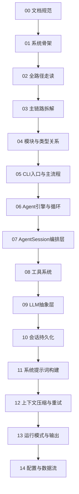

# Pi 源码文档库

> **项目**：Pi Agent Harness (`pi-monorepo`)
> **版本**：0.0.3（commit `853a80d26`）
> **采样时间**：2026-08-31 13:17 CST
> **源码基准**：当前 `main` 分支源码，符号名与代码结构为权威依据。

## 文档结构

按四层逐级深入，每篇文档导航到下一篇。

### 第零层：文档规范

| 文档 | 说明 |
|------|------|
| [00-文档规范与源码定位约定](00-文档规范与源码定位约定.md) | 源码定位规则、图表规范、文档格式约定 |

### 第一层：简单框架

| 文档 | 说明 |
|------|------|
| [01-简单框架-系统骨架](01-简单框架-系统骨架.md) | 进程/模块/组件、职责、依赖关系、主数据流 |

### 第二层：简单例子

| 文档 | 说明 |
|------|------|
| [02-简单例子-全路径走读](02-简单例子-全路径走读.md) | `pi -p "read a file"` 从 CLI 入口到输出的真实全路径 |

### 第三层：详细逐步说明

| 文档 | 说明 |
|------|------|
| [03-详细逐步说明-主链路拆解](03-详细逐步说明-主链路拆解.md) | 主链路逐跳拆解：参数传递、状态变化、数据流、错误传播 |

### 第四层：源码完整补齐

| 文档 | 说明 |
|------|------|
| [04-核心模块与类关系](04-核心模块与类关系.md) | 模块级与类型级：包依赖图、核心 Class/Trait/Interface 关系 |
| [05-CLI入口与主流程](05-CLI入口与主流程.md) | `cli.ts`/`main.ts`/`sdk.ts` 的函数级分析 |
| [06-Agent引擎与循环](06-Agent引擎与循环.md) | `Agent` 类与 `runAgentLoop` 的函数级分析 |
| [07-AgentSession编排层](07-AgentSession编排层.md) | `AgentSession.prompt()`/`_handleAgentEvent()`/auto-retry/compaction |
| [08-工具系统](08-工具系统.md) | read/bash/edit/write 工具的函数级分析 |
| [09-LLM抽象层](09-LLM抽象层.md) | `pi-ai` 的 streamSimple、模型发现、认证 |
| [10-会话持久化](10-会话持久化.md) | `SessionManager`、JSONL 格式、分支/fork |
| [11-系统提示词构建](11-系统提示词构建.md) | `buildSystemPrompt`、skills、context files |
| [12-上下文压缩与重试](12-上下文压缩与重试.md) | compaction、branch summarization、auto-retry |
| [13-运行模式与输出](13-运行模式与输出.md) | InteractiveMode/PrintMode/RpcMode |
| [14-配置与数据流](14-配置与数据流.md) | settings.json、auth.json、models.json、目录结构 |

## 推荐阅读路径



## 源码定位约定

本库使用 **文件路径 + 符号名 + 函数内相对偏移** 定位源码，不依赖绝对行号。

示例：

```
packages/agent/src/agent-loop.ts
函数：runLoop
偏移：+12 ～ +30
```

详见 [00-文档规范与源码定位约定](00-文档规范与源码定位约定.md)。
